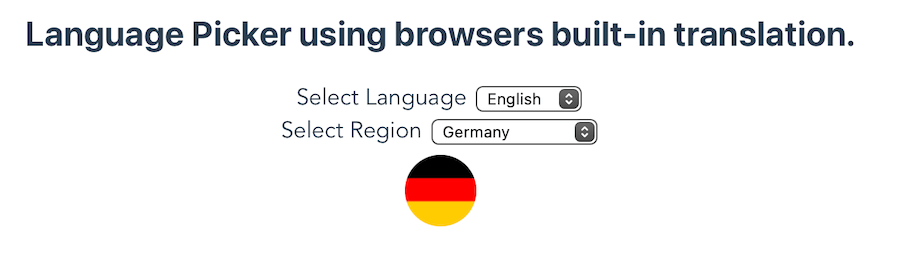

# language picker with Vue.js and browser API

> all translation done by the browser

Using the browser provided [Intl.DisplayNames](https://developer.mozilla.org/en-US/docs/Web/JavaScript/Reference/Global_Objects/Intl/DisplayNames) to translate languages and regions.
